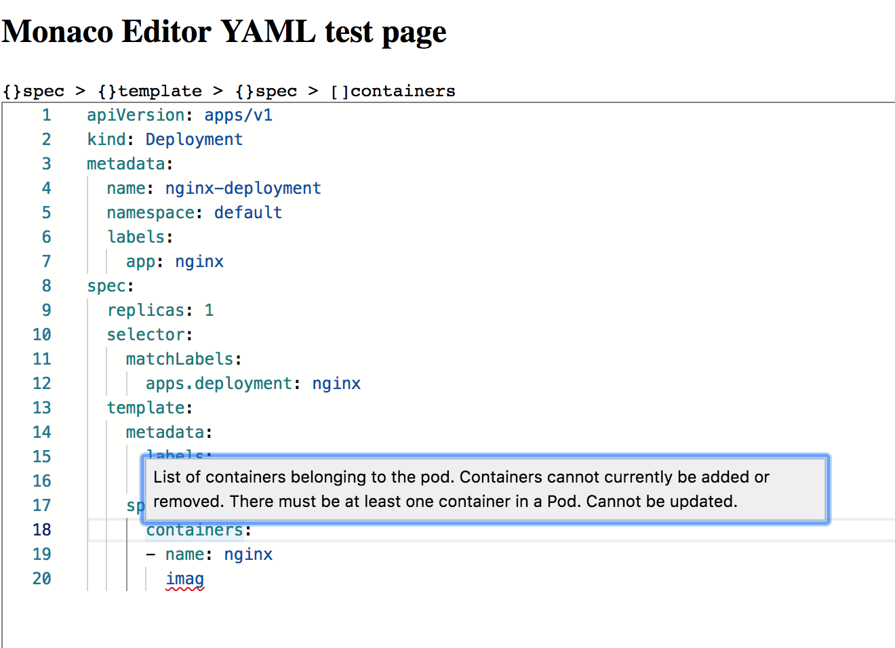

# Monaco YAML

YAML language plugin for the Monaco Editor. It provides the following features when editing YAML files:
* Code completion, based on JSON schemas or by looking at similar objects in the same file
* Hovers, based on JSON schemas
* Validation: Syntax errors and schema validation
* Formatting
* Document Symbols
* Syntax highlighting
* Automatically load remote schema files (by enabling DiagnosticsOptions.enableSchemaRequest)

Schemas can also be provided by configuration. See [here](https://github.com/Microsoft/monaco-json/blob/master/src/monaco.d.ts)
for the API that the JSON plugin offers to configure the JSON language support.

## Installing

`yarn add monaco-yaml`
Both vs loader and ESM are supported.
See `examples` directory for esm and umd examples.

## Development

* `git clone https://github.com/pengx17/monaco-yaml`
* `cd monaco-yaml`
* `yarn`
* open `$/monaco-yaml/demo/index.html` in your favorite browser.

A running example:

## Credits
- https://github.com/redhat-developer/yaml-language-server

### Maintain
Manually clone dependencies list below and update the project files accordingly:
- `src/languageservice`: https://github.com/redhat-developer/yaml-language-server
  - `cp yaml-language-server/src/languageservice monaco-yaml/src/languageservice`
  - Modify the import paths, go to the test page and see if it still works
- `src/yaml-ast-parser-custom-tags`: https://github.com/JPinkney/yaml-ast-parser/tree/master/src

## License
[MIT](https://github.com/pengx17/monaco-yaml/blob/master/LICENSE.md)
